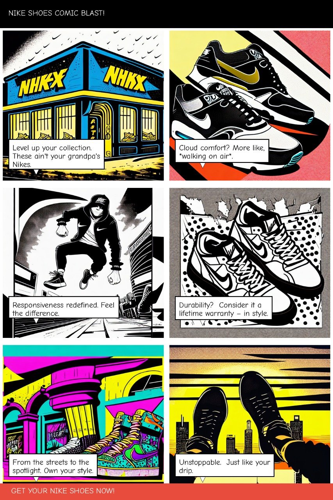
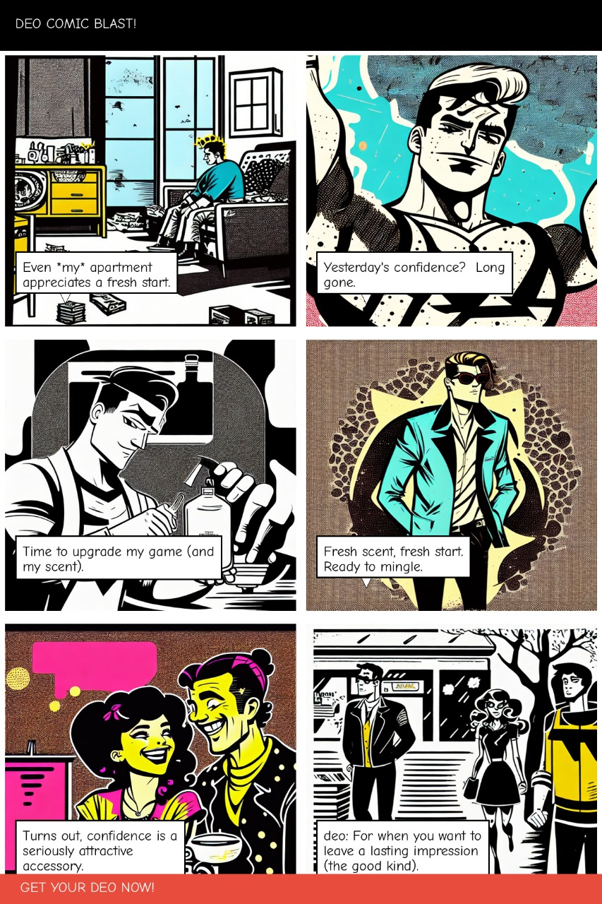

# 🎨 Comicly — AI-Powered Comic Ad Generator

Comicly is a generative AI tool that transforms a simple product description into a witty, anime-style comic strip — perfect for marketing, storytelling, or creative branding. Built using Google’s Agent Development Kit (ADK), Gemini models, and Stable Diffusion.

---

## 🚀 Features

- 🧠 **Script Generation** with Gemini via `StoryAgent`
- 🎨 **Anime-style Image Generation** using Stable Diffusion via `PanelAgent`
- 🧩 **Comic Layout Composition** with speech bubbles via `LayoutAgent`
- 🔁 **Retry mechanism** for failed panel generations
- 📥 Final output as a downloadable PNG comic strip

---

## 🖼️ Sample Output


Comic generated for "Sneakers":


Comic generated for "Deodorant":


---


## 🛠️ Tech Stack

- **Google ADK** (`google-adk==1.4.2`)
- **Gemini 1.5 Flash** via `google-generativeai`
- **Stable Diffusion** via Hugging Face Diffusers (`dreamlike-art/dreamlike-diffusion-1.0`)
- **Python libraries**: `PIL`, `torch`, `textwrap`, `json`, `re`

---

## 🔧 Installation

Code requires a CUDA-compatible GPU environment but since its not there in all computers u can run only the backend.py in google colab for fastest execution with t4 gpu:

```bash
cell 1-!pip install -q google-adk==1.4.2 diffusers transformers accelerate huggingface_hub google-generativeai pillow
cell 2- cell 2- put code of backend.py to execute and enter gemini api key in line after imports
final comic will be downloaded automatically
